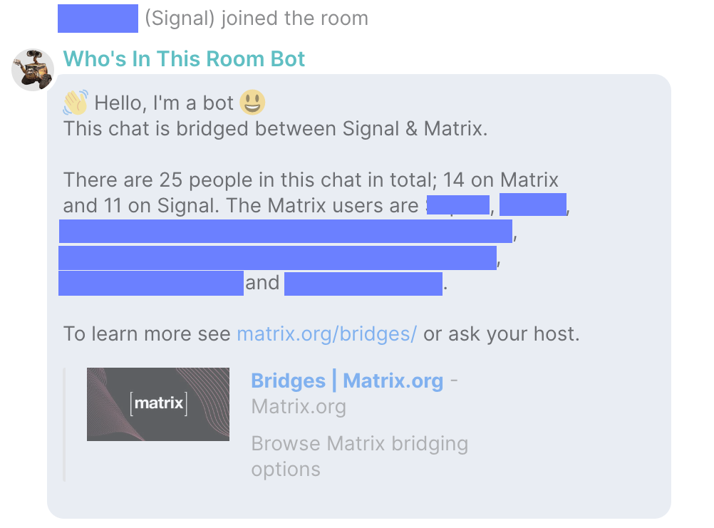

Who's In This Room Matix Bot
============================

Keep Signal users in your Matrix group chats in the loop!

TLDR: In Matrix <-> Signal bridged chats with relay mode enabled, announce Matrix room joins/leaves
and summarise the room members when a Signal user joins (because they can't see)

To ask questions or give feedback please join [#whos-in-this-room-bot-discussion:jakecopp.chat](https://matrix.to/#/#whos-in-this-room-bot-discussion:jakecopp.chat)!

## What is a bridged chat with relay mode?

Matrix is a chat protocol which supports bridges to other chat apps. Some of these bridges support
"relay mode", where you can add people on the other chat app into the same chat that Matrix users
are in.

In this case, the members of the other chat app can't see who the Matrix users are - Matrix solves
this by "double puppetting" the bridged users (almost like "mocked" users), but just about all
other chat apps don't support this.

## What this bot does
Your Signal guests have probably experienced the confusion where they don't know who else is in
the chat (using Matrix).

When this bot is added to a Matrix room, it will announce:
- Who the room members are when a new Signal user joins
- When a Matrix user joins or leaves, who that Matrix user was.

## Examples

Specifically, this is the message sent when the bot is added to a room:
> 👋 Hello, I'm the Who's In This Room Bot 😃
> Each time a Signal user joins the chat I'll send a message saying how many people are in the chat on the Matrix side (as they can't see).
      
> I'll also let them know when Matrix users join or leave.
> For questions or feedback jump into #somewhere:somewhere.org.

When a Signal user joins the room, this is (an example) message the bot sends:
> This chat is bridged between Signal & Matrix.

> There are 2 people in this chat in total; 2 on Matrix and 1 on Signal. The Matrix users are @b:matrix.org, @c:matrix.org.

> See matrix.org/bridges/ or ask your host for more info!

# Local development setup
- Run `yarn`
- Run `yarn build`

## Running in prod
- `yarn`
- `yarn build`
- `yarn start`

# Further work
I'm very open to adding support for more platforms apart from Signal. PRs very welcome!

# License
GNU AGPLv3. See LICENSE